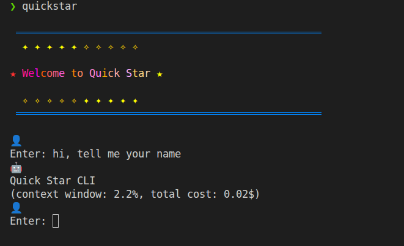

# Agent 学习项目

## 🚀 体验 Quick Star CLI 的强大功能！



**✨ 立即尝试 Quick Star CLI！** 一个具有优雅命令行界面、实时流式响应和强大代码生成能力的智能AI助手。

## 🎮 看看AI能做什么：AI创造的贪吃蛇游戏！


**🎯 来玩贪吃蛇游戏！** 这个功能完整的游戏完全通过与 Quick Star CLI 的自然语言对话创建，展示了：
- 🧠 **智能代码生成** - 从简单描述生成完整游戏逻辑
- 🔧 **实时调试** - 即时迭代和改进代码
- 📁 **智能文件管理** - 处理复杂项目结构
- 🎨 **交互式应用** - 创建引人入胜的用户体验

**准备创造令人惊叹的作品了吗？** 按照下面的安装指南开始使用 Quick Star CLI 创造吧！

---


本项目展示了AI智能体的渐进式开发过程，从基础的工具调用到具有历史记录控制的高级流式智能体。每个章节都在前一章的基础上构建，展示渐进式改进和新功能。

## 项目结构

```
├── .env                          # 环境配置（所有章节共享）
├── .env.example                  # 环境配置模板
├── requirements.txt              # Python 依赖包
├── chapter1_tool_call_api/       # 基础工具调用示例（原生函数调用 & XML 工具调用）
├── chapter2_ReAct_agent/         # 基础 ReAct 智能体实现
├── chapter3_stream_agent/        # 具有实时响应的流式智能体
├── chapter4_history_control/     # 具有对话历史管理的高级智能体
├── chapter5_smart_context/       # 具有智能裁剪的智能上下文管理
└── chapter6_to_do_write/         # 使用TodoWrite工具的任务管理 [新增]
```

## 各章节功能特性

### 第1章：工具调用 API 基础
- **原生函数调用**：具有类型安全的标准 OpenAI JSON Schema 接口
- **XML 工具调用**：兼容任何文本模型的通用 XML 格式
- 两种方法的比较和使用场景
- 理解工具调用模式的基础

### 第2章：ReAct 智能体架构
- **ReAct 模式**：智能体的思考-行动-观察循环
- **递归对话处理**支持连续 AI 交互
- **用户审批系统**为危险操作提供安全控制
- **单例对话管理器**确保状态管理一致性
- 完整的工具执行框架与错误处理

### 第3章：实时流式智能体
- **逐字符流式输出**让 AI 响应立即可见
- **流式工具调用**与工具执行无缝配合
- **配置外部化**使用 .env 文件管理
- 优雅降级，自动回退到标准模式
- 改进用户体验，无需等待完整响应

### 第4章：智能历史管理
- **自动历史压缩**采用智能多会话和单会话策略
- **实时令牌监控**显示上下文使用百分比
- **全面成本跟踪**包含模型特定定价和会话摘要
- **保护保证**始终保留系统消息和最近上下文
- 长时间对话的性能优化

### 第5章：智能上下文裁剪
- **精确上下文控制**支持 TOP/BOTTOM 消息裁剪策略
- **智能上下文裁剪工具**用于手动对话管理
- **安全保证**保护最新用户消息和系统提示
- **摘要支持**为裁剪内容提供上下文连续性
- **集成**现有自动压缩和成本跟踪系统

### 第6章：结构化任务管理
- **TodoWrite 工具**自动任务组织和进度跟踪
- **智能工作流分解**将复杂请求转换为结构化列表
- **实时状态管理**包含 pending/in_progress/completed 生命周期
- **质量保证门控**防止任务提前完成
- **上下文感知**决定何时使用待办列表而非简单执行
- Conda（推荐）或 pip
- OpenAI 兼容的 API 访问权限（OpenRouter、OpenAI 等）

## 安装说明

### 1. 克隆仓库

```bash
https://github.com/woodx9/build-your-claude-code-from-scratch.git
cd build-your-claude-code-from-scratch
```

### 2. 创建并激活 Conda 环境

```bash
# 创建新的 conda 环境
conda create -n agentLearning python=3.11

# 激活环境
conda activate agentLearning
```

### 3. 安装依赖包

您可以使用以下任一方法安装依赖包：

#### 一：从 requirements.txt 安装
```bash
# 安装所有必需的包
pip install -r requirements.txt
```

#### 二：以开发模式安装（推荐用于开发）
```bash
# 或者其他chapter
cd chapter5_smart_context

pip install -e .
```

#### 三：运行
```bash
quickstar
```


#### 四：运行成功
```bash
❯ quickstar

 ══════════════════════════════════════════════════
  ✦ ✦ ✦ ✦ ✦ ✧ ✧ ✧ ✧ ✧ 

★ Welcome to Quick Star ★

  ✧ ✧ ✧ ✧ ✧ ✦ ✦ ✦ ✦ ✦ 
 ══════════════════════════════════════════════════

👤
请输入: hello, relpy one
🤖
Hello! Nice to meet you. How can I help you today?                                                
👤
请输入: 
```


### 4. 环境配置

1. 复制示例环境文件：
   ```bash
   cp .env.example .env
   ```

2. 使用您的 API 凭据编辑 `.env` 文件：
   ```bash
   # OpenAI API 配置
   OPENAI_API_KEY=your_api_key_here
   OPENAI_BASE_URL=https://openrouter.ai/api/v1
   OPENAI_MODEL=anthropic/claude-sonnet-4
   # 单位是 k（千）
   MODEL_MAX_TOKENS=200
   COMPRESS_THRESHOLD=0.8
   ```

### 5. 必需的环境变量

| 变量 | 描述 | 示例 |
|------|------|------|
| `OPENAI_API_KEY` | 您的 API 密钥 | `sk-or-v1-...` |
| `OPENAI_BASE_URL` | API 端点 URL | `https://openrouter.ai/api/v1` |
| `OPENAI_MODEL` | 要使用的模型 | `anthropic/claude-sonnet-4` |
| `MODEL_MAX_TOKENS` | 响应的最大令牌数（以千为单位） | `200` |
| `COMPRESS_THRESHOLD` | 历史压缩阈值（0.0-1.0） | `0.8` |


## API 提供商

本项目支持任何 OpenAI 兼容的 API。经过测试的提供商包括：

- **OpenRouter**（推荐）：提供对多种模型的访问
- **OpenAI**：官方 OpenAI API
- **本地 LLM 服务器**：任何实现 OpenAI API 格式的服务器

### OpenRouter 设置

1. 在 [openrouter.ai](https://openrouter.ai) 注册
2. 从仪表板获取您的 API 密钥
3. 使用 `https://openrouter.ai/api/v1` 作为基础 URL
4. 从可用模型中选择，如：
   - `anthropic/claude-sonnet-4`
   - `openai/gpt-4`
   - `meta-llama/llama-3.1-70b-instruct`

### OpenAI 设置

1. 从 [platform.openai.com](https://platform.openai.com) 获取 API 密钥
2. 使用 `https://api.openai.com/v1` 作为基础 URL
3. 使用如 `gpt-4`、`gpt-3.5-turbo` 等模型

## 开发指南

### 项目结构（每个章节）

```
chapter_X/
├── src/
│   ├── core/
│   │   ├── api_client.py      # 带环境配置的 API 客户端
│   │   └── conversation.py    # 对话管理
│   ├── tools/
│   │   ├── base_agent.py      # 基础智能体实现
│   │   ├── tool_manager.py    # 工具管理
│   │   └── cmd_runner.py      # 命令执行工具
│   └── main.py                # 入口点
├── pyproject.toml             # 项目配置
└── readme.md                  # 章节特定文档
```

**注意**：第1章具有更简单的结构，直接使用 Python 文件演示工具调用概念。

### 核心组件

- **APIClient**：带环境变量配置的单例模式客户端
- **BaseAgent**：实现 ReAct 模式的核心智能体逻辑
- **ToolManager**：管理可用工具及其执行
- **ConversationManager**：处理对话历史和上下文

### 错误处理

项目包含全面的错误处理：

- 缺失环境变量会抛出描述性错误
- API 失败会被捕获并报告
- 工具执行错误会被优雅地处理

## 故障排除

### 常见问题

1. **未找到环境变量**
   ```
   ValueError: 环境变量 OPENAI_API_KEY 未设置或为空。请检查 .env 文件中的配置。
   ```
   **解决方案**：确保 `.env` 文件存在并包含所有必需的变量

2. **API 连接失败**
   ```
   API请求失败: Connection error
   ```
   **解决方案**：检查您的网络连接和 API 端点 URL

3. **无效的 API 密钥**
   ```
   API请求失败: Unauthorized
   ```
   **解决方案**：验证您的 API 密钥是否正确且有足够的余额

### 测试环境设置

```bash
# 测试环境变量是否正确加载
python -c "
import sys
sys.path.append('chapter2_ReAct_agent/src')
from core.api_client import APIClient
client = APIClient()
print('✅ 环境加载成功！')
print(f'使用模型: {client.model}')
"
```

## 贡献指南

1. Fork 仓库
2. 创建功能分支
3. 进行更改
4. 彻底测试
5. 提交 Pull Request

## 许可证

MIT License

## 支持

如有问题和疑问：
1. 查看故障排除部分
2. 查看章节特定的 README 文件
3. 在仓库中提出 issue

---

**注意**：本项目演示了渐进式 AI 智能体开发。从第1章开始了解基础工具调用概念，然后进入第2章学习 ReAct 模式，第3章学习流式处理能力，最后第4章学习高级历史记录管理。

