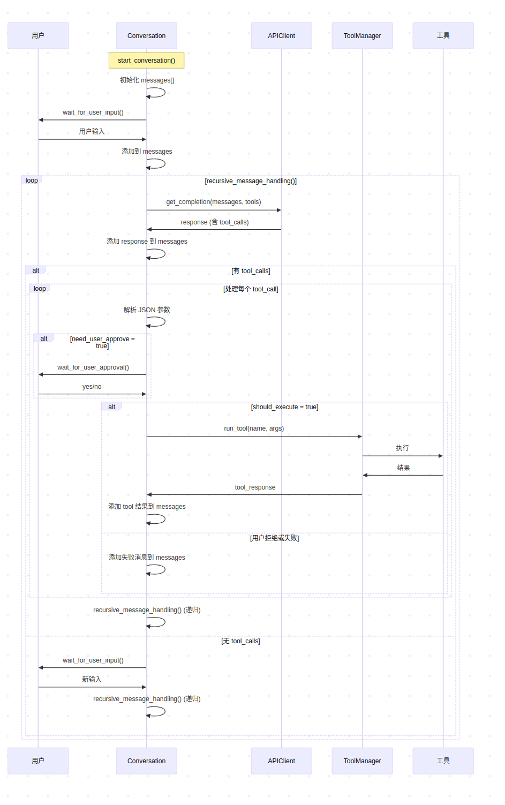

# QuickStar - Stream Agent

一个基于 ReAct（Reasoning and Acting）模式的 AI 代理系统，支持**实时流式输出**、工具调用和用户交互。

## 🚀 新特性 - 流式输出

Chapter3 的主要升级是**实时流式输出**功能：
- ✨ **实时响应**：用户可以看到AI助手逐字生成回复，就像真人打字一样
- 🔄 **流式工具调用**：支持在流式模式下处理工具调用
- 💡 **优雅降级**：如果流式模式失败，自动切换到标准模式
- 🎯 **用户体验优化**：减少等待时间，提升交互感受

## 系统架构


ReAct（Reasoning and Acting）架构通过以下核心流程实现智能代理：

1. **思考（Think）**：AI 模型接收输入并进行推理
2. **行动（Act）**：基于推理结果调用相应工具
3. **观察（Observe）**：获取工具执行结果作为反馈
4. **循环迭代**：将观察结果输入下一轮思考，形成完整的推理-行动循环

这种架构使 AI 代理能够在复杂任务中保持连贯的推理链，并通过工具调用与外部环境交互。

## 核心组件

### 🌊 APIClient - 流式API客户端

[`APIClient`](src/core/api_client.py) 现在支持两种模式：

**标准模式**（兼容 Chapter2）：
```python
def get_completion(self, request_params) -> Message
```

**🆕 流式模式**（Chapter3 新增）：
```python
def get_completion_stream(self, request_params) -> Generator[str, None, None]
```

流式模式特点：
- 逐块返回AI生成的内容
- 支持工具调用在流式响应中的处理
- 自动构建完整的响应消息对象
- 异常处理和错误恢复

### 💬 Conversation - 流式对话管理器



[`Conversation`](src/core/conversation.py) 的流式增强：

**🆕 流式输出方法**：
- `print_streaming_content()` - 实时显示AI生成的内容片段
- `recursive_message_handling()` - 升级支持流式处理

**核心流程**：
1. 🔄 发送消息到 AI 模型（流式）
2. 📺 实时显示AI回复内容
3. 🔍 检查响应是否包含工具调用
4. ✋ 如需批准，等待用户确认
5. ⚡ 执行工具并将结果反馈给 AI
6. 🔁 递归继续对话

### ToolManager 工具管理器

[`ToolManager`](src/tools/tool_manager.py) 保持不变，完全兼容流式模式：

- **工具注册**：统一管理所有可用工具
- **描述生成**：为 AI 提供工具的 JSON Schema 描述
- **执行代理**：根据工具名称分发执行请求

### 工具系统

所有工具继承自 [`BaseAgent`](src/tools/base_agent.py)，目前实现了：

- **CmdRunner**：执行系统命令，支持超时控制和用户批准

## 🎮 使用体验对比

### Chapter2 (标准模式)
```
👤 请输入: 帮我列出当前目录的文件
🤖 [等待3-5秒] 我来帮你列出当前目录的文件...
```

### Chapter3 (流式模式) ✨
```
👤 请输入: 帮我列出当前目录的文件
🤖 我来帮你列出当前目录的文件...
[实时逐字显示，无需等待]
```

## 快速开始

```bash
# 安装依赖
pip install -e .

# 运行程序
quickstar

# 测试流式功能
python test_streaming.py
```

## 配置说明

API 配置在 [`APIClient`](src/core/api_client.py) 中：
- 使用 OpenRouter 作为 API 网关
- 默认模型：Claude Sonnet 4
- 支持自定义 API Key 和 Base URL
- 🆕 流式请求自动设置 `stream=True`

## 🔧 技术实现细节

### 流式响应处理
```python
for chunk in stream:
    if chunk.choices[0].delta.content:
        content_chunk = chunk.choices[0].delta.content
        full_content += content_chunk
        yield content_chunk  # 实时输出
```

### 工具调用在流式中的处理
```python
# 在流式响应中收集工具调用信息
if hasattr(chunk.choices[0].delta, 'tool_calls'):
    # 逐步构建工具调用对象
    # 确保工具调用信息完整
```

### 错误处理和降级
```python
try:
    # 尝试流式模式
    for chunk in stream_generator:
        # 处理流式响应
except Exception as e:
    # 自动降级到标准模式
    response = self._api_client.get_completion(request)
```

## 🎯 Chapter3 vs Chapter2

| 特性 | Chapter2 | Chapter3 |
|------|----------|----------|
| 响应模式 | 批量返回 | 🆕 实时流式 |
| 用户体验 | 需要等待 | 🆕 即时反馈 |
| 工具调用 | ✅ 支持 | ✅ 流式支持 |
| 错误处理 | ✅ 基础 | 🆕 优雅降级 |
| 代码兼容 | - | ✅ 向后兼容 |

这个框架的核心思想是让 AI 能够"思考"（通过对话）和"行动"（通过工具调用），并且在执行可能有风险的操作时需要用户确认。Chapter3 的流式输出进一步提升了用户体验，让交互更加自然流畅。

## 🎨 UI Changes

### Recent Updates
- Enhanced user interface for better streaming experience
- Improved visual feedback during tool execution
- Updated progress indicators for real-time interactions
- Optimized layout for better readability in streaming mode

